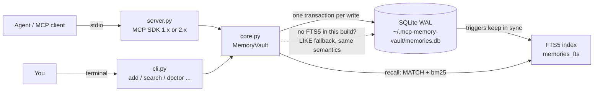

# mcp-memory-vault

<!-- mcp-name: io.github.AleBrito124356/mcp-memory-vault -->

[](https://github.com/AleBrito124356/mcp-memory-vault/actions/workflows/tests.yml)


[](LICENSE)

**MCP server that gives any agent persistent memory: namespaced facts with tags, SQLite FTS5 search that understands plain questions, TTL expiry, and a CLI to inspect and back it all up. Local only, no external services.**

## Why

Agents forget everything the moment a session ends. User preferences, project decisions, environment quirks, customer details: all gone, re-learned (or re-asked) every single time. mcp-memory-vault fixes that with a small local SQLite vault. Any MCP client (Claude Desktop, Claude Code, or your own agent) can store facts as it works and recall them in any later session, with plain questions like "when does ACME prefer to deploy?". Facts are scoped by namespace, labeled with tags and can carry a TTL so short-lived context expires on its own. The storage engine is pure Python standard library: no API keys, no vector database, nothing leaves your machine.

## Tools

| Tool | Arguments | Returns |
| --- | --- | --- |
| `remember` | `content`, `namespace="default"`, `tags=[]`, `ttl_days=0`, `source=""` | The stored memory. An exact duplicate (same content in the same namespace) is never stored twice: the existing memory comes back with `"deduplicated": true`, and new tags are merged into it (`"merged_tags"`). `ttl_days=0` means it never expires. |
| `recall` | `query`, `namespace=""`, `tags=[]`, `limit=8`, `match="auto"` | Ranked hits with a `snippet` (matches in `[brackets]`), `matched_terms`, tags and a readable age ("3 days ago"), plus the normalised `terms` and the `match_mode` used. See [How recall works](#how-recall-works). |
| `forget` | `memory_id` | Deletion confirmation with a preview of what was removed. |
| `list_memories` | `namespace=""`, `tag=""`, `limit=20` | Most recent memories first, including `expires_at` when a TTL is set. |
| `update_memory` | `memory_id`, `content=""`, `add_tags=[]`, `ttl_days=-1`, `remove_tags=[]`, `namespace=""`, `source=""` | The updated memory plus `updated_fields`. `ttl_days`: `-1` keep, `0` remove, `>0` expire that many days from now. `namespace` moves the memory. A change that would duplicate another memory is refused, and the error names that memory. |
| `memory_stats` | none | Totals, counts per namespace, the most used tags, active-TTL count, database size and path, `schema_version`, and `search_mode` (`"fts5"` or `"like"`). |
| `export_memories` | `namespace=""` | All memories as JSON-serialisable dicts, ready for backup or migration. |
| `import_memories` | `memories` (the array from `export_memories`) | Counts of `imported`, `skipped` (duplicates) and `expired` items. The whole batch is validated first and written in one transaction. |

Every tool has a title, a description on each argument, and MCP annotations (`readOnlyHint` on `recall`, `list_memories`, `memory_stats` and `export_memories`; `destructiveHint` on `forget` and `update_memory`), so clients can auto-approve the safe ones. The server also sends instructions that tell the model when to remember, how to recall and how to keep memories accurate.

Errors are returned to the model as tool errors with an actionable message, for example `Memory 999 not found — it may have expired or been forgotten. Use list_memories or recall to find valid ids.`

## How recall works

Agents ask questions, not keyword lists. The query is normalised before it reaches SQLite:

1. It is split on anything that is not a letter or digit, so `ACME's`, `deploy?` and `dark-mode` work.
2. Filler words are dropped (a compact English and Spanish list: "when", "does", "the", "que", "el"...), unless the query is nothing but filler.
3. Words of three or more letters also match by prefix of a light root: `deploys` finds "deploy", "deployed" and "deployment", `kube` finds "Kubernetes". FTS5's porter stemmer still matches the exact word's inflections.

Then `match` decides how the terms combine:

| `match` | Behaviour |
| --- | --- |
| `"auto"` (default) | Memories containing every term. If there are none, memories containing any term, and the result carries a `note` saying the hits are partial. |
| `"all"` | Strict: every term must match. |
| `"any"` | At least one term. Memories matching more terms rank first, then by bm25 relevance, then by recency. |

For example, `recall("When does ACME prefer to deploy?")` searches `acme + prefer + deploy` and finds "Customer ACME prefers deploys on Fridays". `recall("ACME's deploy day")` finds no memory containing "day", so it returns the ACME memory as a partial match with `matched_terms: ["acme", "deploy"]`. When nothing matches, a `hint` suggests what to try next.

Namespace and tag filters (tags are case-insensitive) and the `limit` are applied inside SQLite. On a 30-fact corpus, 17 natural-language, possessive, punctuated, prefix and Spanish queries get the right memory first every time; v0.1.0, which ANDed every raw word, got 5 of them. The table is `tests/test_recall_quality.py`.

## How it works



What the storage engine guarantees:

- **No duplicates.** `(namespace, content)` is unique, enforced by a UNIQUE index, so no path (remember, update, import, or a second process writing to the same file) can create two copies of a fact.
- **Correct expiry.** Every timestamp is stored as canonical UTC (`2026-07-23T12:00:00Z`). Imported timestamps with offsets (`...-08:00`) are converted, so a TTL expires at the right instant. Expired memories are purged before each operation with an index lookup, and no background process is needed.
- **Safe concurrency.** A vault can be shared by the worker threads of the MCP SDK (mcp 2.x runs tools on threads) and by several processes at once (two agents plus the CLI): every write is one `BEGIN IMMEDIATE` transaction, and reads do not take the write lock, so they are not blocked by another process that is writing (the exception is a read that first has to purge an expired memory).
- **Scale.** Indexes cover the dedup lookup, the expiry purge and listing, and the full-text index is only rebuilt when it disagrees with the table. At 50,000 memories, an import takes a few seconds instead of minutes, recall takes about 3 to 45 ms on typical queries, and `list_memories(tag=...)` takes under a millisecond.
- **Versioned schema.** The schema version lives in `PRAGMA user_version`. A vault written by an older release is upgraded in place, in one transaction, the first time it is opened (see [Upgrading from 0.1.0](#upgrading-from-010)).

If the local SQLite build lacks FTS5, the vault falls back to a LIKE search with the same query normalisation, match modes, ranking by matched terms and bracketed snippets. `memory_stats` and `mcp-memory-vault doctor` tell you which mode is active. Set `MEMORY_VAULT_DB` to relocate the database file.

## Quickstart

mcp-memory-vault is installed straight from GitHub (it is not on PyPI yet, see below). Any MCP client that can launch a stdio command works.

**Claude Code** (with [uv](https://docs.astral.sh/uv/)):

```bash
claude mcp add memory-vault -- uvx --from git+https://github.com/AleBrito124356/mcp-memory-vault mcp-memory-vault
```

**Claude Desktop** (`claude_desktop_config.json`):

```json
{
  "mcpServers": {
    "memory-vault": {
      "command": "uvx",
      "args": ["--from", "git+https://github.com/AleBrito124356/mcp-memory-vault", "mcp-memory-vault"]
    }
  }
}
```

**Without uv**, install it into any Python 3.10+ environment and point your client at the `mcp-memory-vault` command:

```bash
pip install git+https://github.com/AleBrito124356/mcp-memory-vault
mcp-memory-vault doctor     # check the setup
mcp-memory-vault            # no command = the MCP server on stdio (clients launch it for you)
```

The server works with both major versions of the official `mcp` SDK (1.10+ and 2.x), so it can share an environment with other MCP tooling.

> **PyPI:** publication is pending. The `publish` workflow releases to PyPI when a `v*` tag is pushed, and `server.json` describes the package for the official MCP registry. Until then, `uvx mcp-memory-vault` and `pip install mcp-memory-vault` will not find the package.

## CLI

The same command is a CLI for the vault's owner: see what your agents remembered, fix or delete it, back it up, and diagnose setup problems. Every command except `serve` works without the `mcp` package. `--db PATH` and `--json` are accepted before or after the command.

| Command | What it does |
| --- | --- |
| `serve` (or no command) | Run the MCP server on stdio. |
| `add CONTENT` | Remember a fact (`-n` namespace, `-t` tag (repeatable), `--ttl-days`, `--source`; `-` reads stdin). |
| `search QUERY` | Search (`--match auto\|all\|any`, `-n`, `-t`, `--limit`). |
| `list` | Most recent first (`-n`, `-t`, `--limit`). |
| `show ID` | One memory in full. |
| `edit ID` | `--content`, `--add-tag`, `--remove-tag`, `--namespace` (move), `--source`, `--ttl-days`. |
| `forget ID [ID...]` | Delete memories. |
| `stats` | Totals, namespaces, top tags, schema, size. |
| `export [-o FILE]` | JSON backup (stdout by default). |
| `import FILE` | Import an export (or a bare JSON array; `-` reads stdin). Duplicates are skipped. |
| `doctor` | Check Python, SQLite, FTS5, the database (writable, integrity, schema, index sync) and the installed `mcp`. Read-only; exits 1 on problems. |

Real output:

```console
$ mcp-memory-vault search "when does ACME prefer to deploy?"
1 hit for "when does ACME prefer to deploy?" (terms: acme, prefer, deploy; fts5, match: all)
#1     [support] Customer [ACME] [prefers] [deploys] on Fridays
       tags: customer, deploy · just now · matched: acme, prefer, deploy

$ mcp-memory-vault search "ACME's deploy day"
2 hits for "ACME's deploy day" (terms: acme, deploy, day; fts5, match: any)
note: No memory contains every term, so these are partial matches, best first — check matched_terms before relying on them.
#1     [support] Customer [ACME] prefers [deploys] on Fridays
       tags: customer, deploy · just now · matched: acme, deploy
#2     [support] [ACME]'s billing contact is Jane Doe
       tags: customer, billing · just now · matched: acme

$ mcp-memory-vault list --tag infra
#4     [atlas] Project Atlas uses Postgres 16 with pgvector
       tags: infra · just now
#3     [ops] Globex staging database resets nightly at 02:00 UTC
       tags: infra · just now · expires 2026-10-23T16:51:22Z

$ mcp-memory-vault edit 2 --add-tag finance --remove-tag billing
Updated memory 2 (tags).
       id: 2
namespace: support
  content: ACME's billing contact is Jane Doe
     tags: customer, finance
   source: -
  created: 2026-09-23T16:51:22Z (just now)
  updated: 2026-09-23T16:51:23Z
  expires: never

$ mcp-memory-vault --db memories.db stats
memories      4  (1 with a TTL)
namespaces    support (2), atlas (1), ops (1)
top tags      customer (2), infra (2), deploy (1), finance (1)
search        fts5
schema        v2
database      memories.db (48.0 KiB)

$ mcp-memory-vault export -o backup.json
Exported 4 memories to backup.json
$ mcp-memory-vault --db other.db import backup.json
Imported 4 memories, skipped 0 duplicates.

$ mcp-memory-vault --db memories.db doctor
[  ok] mcp-memory-vault  0.2.0
[  ok] python            3.14.2
[  ok] sqlite            3.50.4
[  ok] fts5              available (ranked full-text search)
[  ok] database path     memories.db (from --db)
[  ok] database          memories.db (4 memories, integrity ok)
[  ok] schema            v2 (current)
[  ok] search index      in sync with the memories table
[  ok] mcp               2.2.0 (SDK 2.x, server imports fine)

All good.
```

## Example session

A support agent learns something today and uses it next week, in a completely new session.

**Session 1 (Monday):**

> **User:** Heads up — ACME told us they only want production deploys on Fridays. Keep that in mind.
>
> **Agent:** Noted — I'll store that so I remember it in future sessions.
>
> *Calls `remember(content="Customer ACME prefers deploys on Fridays", namespace="support", tags=["customer", "deploy"], source="user note 2026-07-20")`*
>
> → `{"id": 1, "deduplicated": false, "merged_tags": [], "message": "Stored memory 1 in namespace 'support'."}`

**Session 2 (a week later, fresh context):**

> **User:** ACME's fix is ready. When should we ship it?
>
> **Agent:** Let me check what I know about ACME's deploy preferences.
>
> *Calls `recall(query="What are ACME's deploy preferences?", namespace="support")`*
>
> → `{"terms": ["acme", "deploy", "preferences"], "match_mode": "all", "count": 1, "hits": [{"id": 1, "snippet": "Customer [ACME] [prefers] [deploys] on Fridays", "matched_terms": ["acme", "deploy", "preferences"], "tags": ["customer", "deploy"], "age": "1 week ago"}]}`
>
> **Agent:** ACME prefers deploys on Fridays (you told me a week ago). Today is Wednesday, so I'd schedule the release for this Friday.

## Upgrading from 0.1.0

Nothing to do: the first time 0.2.0 opens an existing vault it upgrades it in place, in one transaction.

- Timestamps written with an offset are converted to UTC, so TTLs expire at the right time.
- Exact duplicates left behind by 0.1.0's `update_memory` are folded into the oldest copy: tags are merged, the earliest `created_at` is kept, the memory stays permanent if any copy was, and distinct sources are joined.
- Tags that differ only in case are merged, and memories gain an `updated_at` field.
- The indexes are created and the search index is rebuilt once.

Run `mcp-memory-vault doctor` first if you want to see what will happen: it reports the schema version without changing anything. Downgrading is not supported, so take an `export` first if you might need to go back. If an old 0.1.0 install keeps writing to the same file, 0.2.0 repairs those rows (timestamps, tag index) the next time it opens the vault.

Behaviour changes worth knowing:

- `recall` defaults to `match="auto"`: when no memory contains every term, you now get partial matches (flagged with a `note`) instead of nothing. Pass `match="all"` for the old strict behaviour.
- Tags are case-insensitive, and remembering an existing fact with new tags adds them instead of dropping them.
- `update_memory` refuses to turn a memory into a duplicate of another one.
- `import_memories` is all-or-nothing and skips items that have already expired (reported as `expired`).

## Development

```bash
git clone https://github.com/AleBrito124356/mcp-memory-vault
cd mcp-memory-vault
python -m venv .venv && . .venv/bin/activate   # Windows: .venv\Scripts\activate
pip install -e ".[dev]"
python -m pytest
python -m mcp_memory_vault.server               # run the stdio server from the source tree
```

The test suite covers every layer:

- `test_core.py`, `test_integrity.py`, `test_migration.py`, `test_concurrency.py`: the storage engine. This covers dedup, canonical timestamps and TTLs, case-insensitive tags, index use, upgrading a raw-SQL v0.1.0 vault, and 8 threads sharing one vault. These tests need only the standard library.
- `test_recall_quality.py`: the natural-language query table, in both FTS5 and LIKE mode.
- `test_server.py`: every tool through a real in-memory MCP client session, including the error path. The model must see messages like "Memory 999 not found ... use list_memories".
- `test_stdio_e2e.py`: spawns `python -m mcp_memory_vault.server` and speaks raw JSON-RPC over stdio, the same way Claude Desktop does.
- `test_cli.py`: every CLI command as a subprocess, including a run without the `mcp` package.

The server tests run against whichever `mcp` is installed. To cover both SDK generations, run the suite once after `pip install "mcp<2"` and once after `pip install "mcp>=2,<3"`. It passes on mcp 1.10.0, 1.30.0 and 2.2.0.

## Related MCP servers

Part of a family of small, dependency-light MCP servers:

- [mcp-decision-lab](https://github.com/AleBrito124356/mcp-decision-lab): weighted decision matrices with sensitivity analysis
- [mcp-devils-advocate](https://github.com/AleBrito124356/mcp-devils-advocate): stress-test a claim with devil's advocate, premortem and assumption audits
- [mcp-secret-sentinel](https://github.com/AleBrito124356/mcp-secret-sentinel): scan code for exposed secrets, always redacted
- [mcp-git-historian](https://github.com/AleBrito124356/mcp-git-historian): churn hotspots, blame summaries, bus factor

## License

MIT
