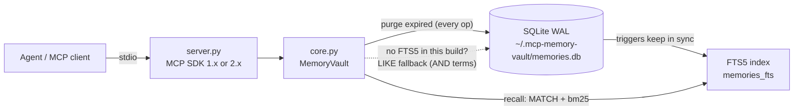

# mcp-memory-vault

<!-- mcp-name: io.github.AleBrito124356/mcp-memory-vault -->

[](https://github.com/AleBrito124356/mcp-memory-vault/actions/workflows/tests.yml)


[](LICENSE)

**MCP server that gives any agent persistent memory — namespaced facts with tags, SQLite FTS5 full-text search, TTL expiry and zero external dependencies.**

## Why

Agents forget everything the moment a session ends. User preferences, project decisions, environment quirks, customer details — all gone, re-learned (or re-asked) every single time. mcp-memory-vault fixes that with a tiny local SQLite vault: any MCP client (Claude Desktop, Claude Code, or your own agent) can store facts as it works and recall them in any later session with ranked full-text search. Facts can be scoped by namespace, labeled with tags, and given a TTL so short-lived context expires on its own. Everything runs locally on the Python standard library — no external services, no API keys, no vector database.

## Tools

| Tool | Arguments | Returns |
| --- | --- | --- |
| `remember` | `content`, `namespace="default"`, `tags=[]`, `ttl_days=0`, `source=""` | The stored memory (id, timestamps, tags) — or the existing one with `"deduplicated": true` if the exact same content already exists in that namespace. `ttl_days=0` means it never expires. |
| `recall` | `query`, `namespace=""`, `tags=[]`, `limit=8` | Ranked hits (bm25 relevance, recency tiebreak) with highlighted snippet, tags, and readable age ("3 days ago"). All query terms must match (AND). |
| `forget` | `memory_id` | Deletion confirmation with a preview of what was removed. |
| `list_memories` | `namespace=""`, `tag=""`, `limit=20` | Most recent memories first, including `expires_at` when a TTL is set. |
| `update_memory` | `memory_id`, `content=""`, `add_tags=[]`, `ttl_days=-1` | The updated memory plus `updated_fields`. `ttl_days`: `-1` keep TTL, `0` remove it, `>0` set a new expiry from now. |
| `memory_stats` | — | Totals, counts per namespace, active-TTL count, database file size and path, and `search_mode` (`"fts5"` or `"like"` fallback). |
| `export_memories` | `namespace=""` | All memories as plain JSON-serializable dicts, ready for backup or migration. |
| `import_memories` | `memories` (array from `export_memories`) | Counts of imported and skipped (duplicate) items, with validation of every entry. |

## How it works



Every read or write first purges expired rows, so TTLs need no background process. If the local SQLite build lacks FTS5, the vault detects it at startup and falls back to a term-wise LIKE search — `memory_stats` tells you which mode is active. Set the `MEMORY_VAULT_DB` environment variable to relocate the database file.

## Quickstart

mcp-memory-vault is installed straight from GitHub (it is not on PyPI yet, see below). Any MCP client that can launch a stdio command works.

**Claude Code** (with [uv](https://docs.astral.sh/uv/)):

```bash
claude mcp add memory-vault -- uvx --from git+https://github.com/AleBrito124356/mcp-memory-vault mcp-memory-vault
```

**Claude Desktop** (`claude_desktop_config.json`):

```json
{
  "mcpServers": {
    "memory-vault": {
      "command": "uvx",
      "args": ["--from", "git+https://github.com/AleBrito124356/mcp-memory-vault", "mcp-memory-vault"]
    }
  }
}
```

**Without uv**, install it into any Python 3.10+ environment and point your client at the `mcp-memory-vault` command:

```bash
pip install git+https://github.com/AleBrito124356/mcp-memory-vault
mcp-memory-vault            # speaks MCP over stdio; clients launch it for you
```

The server works with both major versions of the official `mcp` SDK (1.10+ and 2.x), so it can share an environment with other MCP tooling.

> **PyPI:** publication is pending. The `publish` workflow releases to PyPI (and `server.json` describes the package for the official MCP registry) when a `v*` tag is pushed; until then `uvx mcp-memory-vault` and `pip install mcp-memory-vault` will not find the package.

## Example session

A support agent learns something today and uses it next week — in a completely new session.

**Session 1 (Monday):**

> **User:** Heads up — ACME told us they only want production deploys on Fridays. Keep that in mind.
>
> **Agent:** Noted — I'll store that so I remember it in future sessions.
>
> *Calls `remember(content="Customer ACME prefers deploys on Fridays", namespace="support", tags=["customer", "deploy"], source="user note 2026-07-20")`*
>
> → `{"id": 14, "deduplicated": false, "message": "Stored memory 14 in namespace 'support'."}`
>
> **Agent:** Saved. I'll recall ACME's Friday-only deploy preference whenever deployment scheduling comes up.

**Session 2 (a week later, fresh context):**

> **User:** ACME's fix is ready. When should we ship it?
>
> **Agent:** Let me check what I know about ACME's deploy preferences.
>
> *Calls `recall(query="ACME deploy", namespace="support")`*
>
> → `{"count": 1, "search_mode": "fts5", "hits": [{"id": 14, "snippet": "Customer [ACME] prefers [deploys] on Fridays", "tags": ["customer", "deploy"], "age": "1 week ago"}]}`
>
> **Agent:** ACME prefers deploys on Fridays (noted a week ago from your message). Today is Wednesday — I'd schedule the release for this Friday.

## Development

```bash
git clone https://github.com/AleBrito124356/mcp-memory-vault
cd mcp-memory-vault
python -m venv .venv && . .venv/bin/activate   # Windows: .venv\Scripts\activate
pip install -e ".[dev]"
python -m pytest
python -m mcp_memory_vault.server               # run the stdio server from the source tree
```

The suite covers three layers:

- `tests/test_core.py`, `tests/test_concurrency.py`: the storage engine, including 8 threads sharing one vault. They need only the standard library.
- `tests/test_server.py`: every tool through a real in-memory MCP client session, including the error path (the model must see messages like "Memory 999 not found ... use list_memories").
- `tests/test_stdio_e2e.py`: spawns `python -m mcp_memory_vault.server` and speaks raw JSON-RPC over stdio, exactly like Claude Desktop does.

The server tests run against whichever `mcp` is installed; run the suite once with `pip install "mcp<2"` and once with `pip install "mcp>=2,<3"` to cover both SDK generations.

## Related MCP servers

Part of a family of small, dependency-light MCP servers:

- [mcp-decision-lab](https://github.com/AleBrito124356/mcp-decision-lab) — weighted decision matrices with sensitivity analysis
- [mcp-devils-advocate](https://github.com/AleBrito124356/mcp-devils-advocate) — stress-test a claim: devil's advocate, premortem, assumption audits
- [mcp-secret-sentinel](https://github.com/AleBrito124356/mcp-secret-sentinel) — scan code for exposed secrets, always redacted
- [mcp-git-historian](https://github.com/AleBrito124356/mcp-git-historian) — churn hotspots, blame summaries, bus factor

## License

MIT
