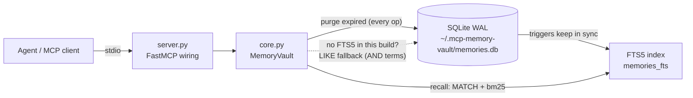

# mcp-memory-vault


**MCP server that gives any agent persistent memory — namespaced facts with tags, SQLite FTS5 full-text search, TTL expiry and zero external dependencies.**

## Why

Agents forget everything the moment a session ends. User preferences, project decisions, environment quirks, customer details — all gone, re-learned (or re-asked) every single time. mcp-memory-vault fixes that with a tiny local SQLite vault: any MCP client (Claude Desktop, Claude Code, or your own agent) can store facts as it works and recall them in any later session with ranked full-text search. Facts can be scoped by namespace, labeled with tags, and given a TTL so short-lived context expires on its own. Everything runs locally on the Python standard library — no external services, no API keys, no vector database.

## Tools

| Tool | Arguments | Returns |
| --- | --- | --- |
| `remember` | `content`, `namespace="default"`, `tags=[]`, `ttl_days=0`, `source=""` | The stored memory (id, timestamps, tags) — or the existing one with `"deduplicated": true` if the exact same content already exists in that namespace. `ttl_days=0` means it never expires. |
| `recall` | `query`, `namespace=""`, `tags=[]`, `limit=8` | Ranked hits (bm25 relevance, recency tiebreak) with highlighted snippet, tags, and readable age ("3 days ago"). All query terms must match (AND). |
| `forget` | `memory_id` | Deletion confirmation with a preview of what was removed. |
| `list_memories` | `namespace=""`, `tag=""`, `limit=20` | Most recent memories first, including `expires_at` when a TTL is set. |
| `update_memory` | `memory_id`, `content=""`, `add_tags=[]`, `ttl_days=-1` | The updated memory plus `updated_fields`. `ttl_days`: `-1` keep TTL, `0` remove it, `>0` set a new expiry from now. |
| `memory_stats` | — | Totals, counts per namespace, active-TTL count, database file size and path, and `search_mode` (`"fts5"` or `"like"` fallback). |
| `export_memories` | `namespace=""` | All memories as plain JSON-serializable dicts, ready for backup or migration. |
| `import_memories` | `memories` (array from `export_memories`) | Counts of imported and skipped (duplicate) items, with validation of every entry. |

## How it works



Every read or write first purges expired rows, so TTLs need no background process. If the local SQLite build lacks FTS5, the vault detects it at startup and falls back to a term-wise LIKE search — `memory_stats` tells you which mode is active. Set the `MEMORY_VAULT_DB` environment variable to relocate the database file.

## Quickstart

```bash
pip install -e .
```

**Claude Desktop** — add to `claude_desktop_config.json`:

```json
{
  "mcpServers": {
    "memory-vault": {
      "command": "python",
      "args": ["/absolute/path/to/server.py"]
    }
  }
}
```

**Claude Code**:

```bash
claude mcp add memory-vault -- python /absolute/path/to/server.py
```

## Example session

A support agent learns something today and uses it next week — in a completely new session.

**Session 1 (Monday):**

> **User:** Heads up — ACME told us they only want production deploys on Fridays. Keep that in mind.
>
> **Agent:** Noted — I'll store that so I remember it in future sessions.
>
> *Calls `remember(content="Customer ACME prefers deploys on Fridays", namespace="support", tags=["customer", "deploy"], source="user note 2026-07-20")`*
>
> → `{"id": 14, "deduplicated": false, "message": "Stored memory 14 in namespace 'support'."}`
>
> **Agent:** Saved. I'll recall ACME's Friday-only deploy preference whenever deployment scheduling comes up.

**Session 2 (a week later, fresh context):**

> **User:** ACME's fix is ready. When should we ship it?
>
> **Agent:** Let me check what I know about ACME's deploy preferences.
>
> *Calls `recall(query="ACME deploy", namespace="support")`*
>
> → `{"count": 1, "search_mode": "fts5", "hits": [{"id": 14, "snippet": "Customer [ACME] prefers [deploys] on Fridays", "tags": ["customer", "deploy"], "age": "1 week ago"}]}`
>
> **Agent:** ACME prefers deploys on Fridays (noted a week ago from your message). Today is Wednesday — I'd schedule the release for this Friday.

## Development

```bash
pip install -e ".[dev]"
python -m pytest
```

Tests exercise `core.py` directly and run without the `mcp` package installed.

## License

MIT
